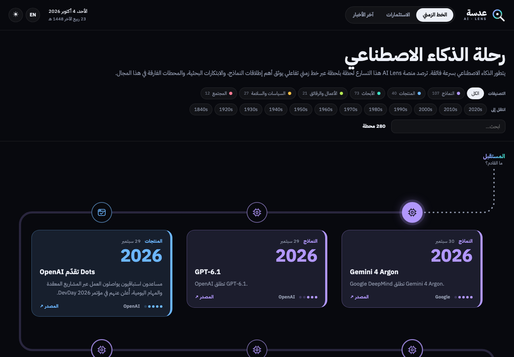
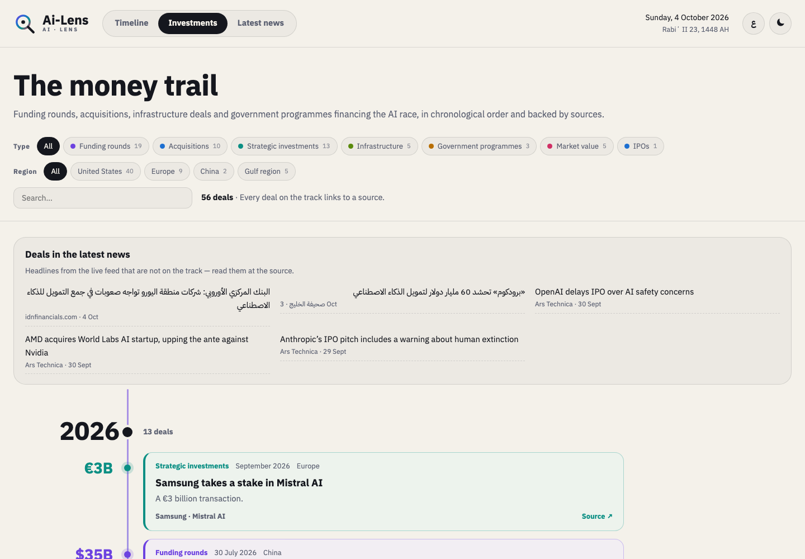
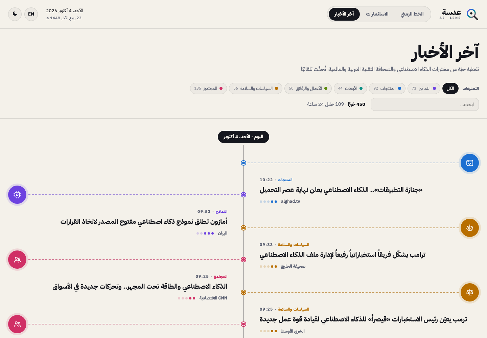

<div align="center">


# عدسة · Ai-Lens

**الخط الزمني للذكاء الاصطناعي — التاريخ، والاستثمارات، والأخبار الحية**
**The AI timeline: history, investments and live news**

**[ailens.live](https://ailens.live)** · [العربية](#العربية) · [English](#english)

[](LICENSE)
[](https://github.com/maghrebme/ai-lens/actions/workflows/pages.yml)

</div>



---

<div dir="rtl">

## العربية

**الموقع:** [ailens.live](https://ailens.live)

يتطور الذكاء الاصطناعي بسرعة فائقة. ترصد منصة **عدسة** هذا التسارع لحظة بلحظة عبر خط زمني تفاعلي يوثق أهم إطلاقات النماذج، والابتكارات البحثية، والمحطات الفارقة في هذا المجال.

الواجهة **عربية افتراضيًا** مع دعم كامل للإنجليزية، ومظهر داكن وفاتح، وتعمل على الهاتف والحاسوب.

### الصفحات

| الصفحة | المحتوى |
|---|---|
| **الخط الزمني** | 286 محطة من عام 1843 حتى اليوم على خط متعرّج يبدأ من المستقبل في الأعلى وينتهي بالبدايات في الأسفل. بطاقات كاملة، وخط يمتلئ مع التمرير، وانتقال سريع بين العقود. تُضاف إطلاقات النماذج الكبرى تلقائيًا من موجزات المختبرات الرسمية. |
| **الاستثمارات** | 88 صفقة من جولات التمويل والاستحواذات وصفقات البنية التحتية والبرامج الحكومية والطروحات العامة (2010 ← 2026) على مسار عمودي يبرز قيمة كل صفقة. |
| **آخر الأخبار** | تغطية حيّة من 16 مصدرًا (مختبرات الذكاء الاصطناعي والصحافة التقنية العربية والعالمية) تُحدَّث تلقائيًا كل 12 ساعة، مجمّعة حسب اليوم على خط زمني عمودي. |

ميزات مشتركة: تصفية حسب التصنيف والنوع والمنطقة، وبحث، ونافذة «المصادر والمراجع» في التذييل لإخفاء أي مصدر، والتاريخ الهجري والميلادي.

### بيانات موثّقة

كل محطة وكل صفقة مرتبطة **بمصدر يمكن فتحه**. جرى التحقق من التواريخ مقابل نصوص ويكيبيديا وسجلات arXiv والمصادر الرسمية، ومن المبالغ مقابل المصادر نفسها. وحين لا يتأكد سوى الشهر أو السنة، تعرض البطاقة ذلك فقط دون تخمين اليوم.
الطريقة والتصحيحات والإدخالات المحذوفة موثّقة في [md-doc/verification.md](md-doc/verification.md).

### التشغيل محليًا

يتطلب Python 3.10 أو أحدث، دون أي مكتبات إضافية:

</div>

```sh
cp .env.example .env
./tools/start.sh        # http://127.0.0.1:8420/
./tools/stop.sh
```

<div dir="rtl">

**اختياري — عناوين بالعربية والإنجليزية عبر Claude:** بدونها تظهر العناوين بلغتها الأصلية. ومعها يحصل كل خبر جديد على عنوان وملخّص بالعربية والإنجليزية وتصنيف ودرجة أهمية. يُترجَم كل خبر مرة واحدة فقط.

</div>

```sh
./tools/setup-enrichment.sh
echo 'ANTHROPIC_API_KEY=sk-ant-...' >> .env
./tools/stop.sh && ./tools/start.sh
```

<div dir="rtl">

### النشر

يُبنى الموقع كملفات ثابتة، ويعيد **GitHub Actions** بناءه ونشره على **GitHub Pages** كل 12 ساعة، **مجانًا** للمستودعات العامة. التفاصيل وإعداد نطاق خاص في [md-doc/deploy.md](md-doc/deploy.md).

### المساهمة

نرحّب بالتصحيحات والإضافات. **كل محطة أو صفقة جديدة يجب أن ترفق رابطًا لمصدر** يؤكد التاريخ (والمبلغ للصفقات). استخدم `"precision": "month"` أو `"year"` حين لا يتأكد اليوم.

- المحطات: [assets/data/milestones.json](assets/data/milestones.json)
- الاستثمارات: [assets/data/investments.json](assets/data/investments.json)
- مصادر الأخبار: [python/sources.py](python/sources.py)

### شكر وتقدير

- فكرة الموقع مستلهمة من مشروع [aitimeline](https://github.com/imfurman/aitimeline) (رخصة MIT).
- الأخبار ملك ناشريها، وعدسة تعرض المعلومات حسب المصادر الأصلية.
- الخط: [IBM Plex Sans Arabic](https://github.com/IBM/plex) برخصة SIL OFL 1.1.

### الرخصة

الشيفرة مرخّصة بموجب [MIT](LICENSE).

</div>

---

## English

**Live site:** [ailens.live](https://ailens.live)

AI evolves at breakneck speed. **Ai-Lens** tracks the acceleration in real time, mapping every major model release, research breakthrough and industry milestone on a single interactive timeline.

The interface is **Arabic by default** with full English support, dark and light themes, and works on phones and desktops.



### Pages

| Page | What it shows |
|---|---|
| **Timeline** (`index.html`) | 286 milestones from 1843 to today on a "snake" progress line, future at the top and origins at the bottom. Full cards, a line that fills as you scroll, and decade shortcuts. Major model launches from the labs' official feeds join it automatically. |
| **Investments** (`invest.html`) | 88 funding rounds, acquisitions, infrastructure deals, government programmes and IPOs (2010 → 2026) on a vertical track that puts each amount first. |
| **Latest news** (`news.html`) | A live feed from 16 sources (AI labs, international and Arabic tech press), refreshed every 12 hours and grouped by day on a vertical timeline. |

Shared features:
- Category, type and region filters, plus search.
- A "Sources & references" dialog in the footer, where you can untick any source to hide its content.
- Hijri and Gregorian dates.



### Verified data

Every milestone and every deal links to a **source you can open**. Dates were checked against Wikipedia's article text, arXiv submission records and official sources, and amounts against the same sources. Where only the month or year is confirmed, the card shows only that, never a guessed day. The method, the corrections made and the entries removed are documented in [md-doc/verification.md](md-doc/verification.md).

### Run locally

Requires Python 3.10+, with no dependencies.

```sh
cp .env.example .env
./tools/start.sh        # http://127.0.0.1:8420/
./tools/stop.sh
```

**Optional: Arabic and English headlines with Claude.** Without it, headlines appear in their original language. With it, each new story gets an Arabic and English headline and summary, a category and an importance score. Each story is translated once.

```sh
./tools/setup-enrichment.sh
echo 'ANTHROPIC_API_KEY=sk-ant-...' >> .env
./tools/stop.sh && ./tools/start.sh
```

### Deploy

The site builds to static files (`python python/build_static.py`). **GitHub Actions** rebuilds and publishes it to **GitHub Pages** every 12 hours, **free** for public repositories. See [md-doc/deploy.md](md-doc/deploy.md) for setup and using your own domain.

### Configuration

| Variable | Default | |
|---|---|---|
| `ENV_TYPE` | `local` | `server` adds a short cache on `/api/news` |
| `HOST` / `PORT` | `127.0.0.1` / `8420` | |
| `BASE_PATH` | empty | set when served under a prefix, e.g. `/ai-lens` |
| `DATA_PATH` / `LOG_PATH` | `./data` / `./logs` | |
| `REFRESH_MINUTES` / `RETENTION_DAYS` | `720` (12 h) / `45` | |
| `ENRICH`, `ENRICH_MODEL`, `ENRICH_MAX_PER_REFRESH` | `auto`, `claude-opus-5-5`, `120` | optional Claude translation |

### Project layout

```
index.html · invest.html · news.html     the three pages
assets/css, assets/js                    plain ES modules, no build step
assets/data/                             verified milestones and investments
assets/fonts/                            IBM Plex Sans Arabic (SIL OFL 1.1)
python/server.py                         local server with scheduled refresh
python/news.py · sources.py              feed fetching, classification, clustering
python/enrich.py                         optional Claude translation
python/build_static.py                   static build for any static host
tools/                                   start / stop / setup scripts
.github/workflows/pages.yml              scheduled build and deploy
md-doc/                                  verification log and deployment guide
```

### Contributing

Corrections and additions are welcome. **Every new milestone or deal must link to a source** that confirms the date (and the amount, for deals). Use `"precision": "month"` or `"year"` when the exact day isn't confirmed. Pull requests without a source will not be merged.

### Credits

- The idea was inspired by [aitimeline](https://github.com/imfurman/aitimeline) (MIT).
- News belongs to its publishers; Ai-Lens presents information as reported by the original sources.
- Font: [IBM Plex Sans Arabic](https://github.com/IBM/plex), SIL Open Font License 1.1.

### License

Code: [MIT](LICENSE) © 2026 maghreb.me
